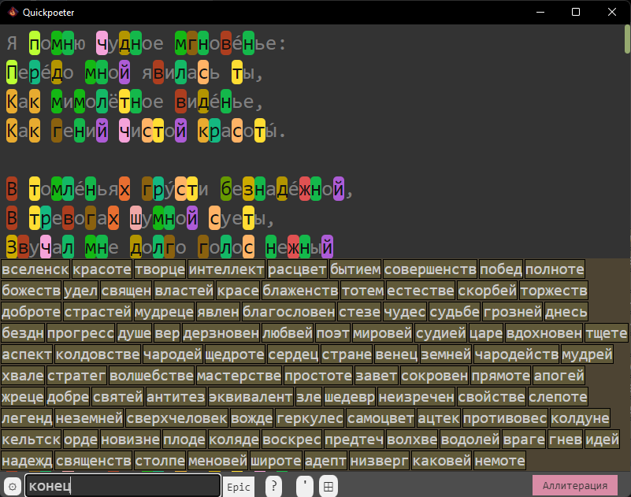

### Как пользоваться

Редактор на текущий момент состоит из двух основных компонент: подсветки и подбора рифм. Использует [quickpoeter_core](https://github.com/sitandr/quickpoeter_core) как основной компонент бекэнда.

Выбор подсветки управляется кнопкой в правом нижнем углу. Когда подсветка выбрана, можно нажать `Alt + V`,
чтобы перейти в режим отображения только квадратов, соответствующим различным буквам.

Длину гласных можно увеличивать/уменьшать с помощью `Ctrl + ,` (<), `Ctrl + .` (>). Можно добавлять паузы с помощью `Ctrl + Space`.
Ударение в тексте можно поставить с помощью `Ctrl + '` после гласной (переопределит текущее, если есть, можно ставить несколько на слово).

Можно искать слово "по паттерну" ударных-безударных, например, "б+!" найдет двухсложное слово, начинающееся на "б" с ударением на второй слог (+ — произвольный безударный слог, ! — произвольный ударный).

Поле ввода снизу позволяет вводить слова, к которым нужно найти рифму. Нажмите `Enter`, и почти сразу выскочит плашка с подобранными словами.

Кнопка справа позволяет выбрать тематику подбора рифм — слова, близкие по смыслу к указанной теме, будут получать бонус к качеству подбора.  
Можно использовать `Auto` — создает тему автоматически из слов текущего текста.  
Использование `New` позволяет "прямо сейчас" создать тему, введя характерные слова.

Рифматор очень широко настраивается через **yaml**-файлы с коэффициентами. Увидеть текущие доступные настройки можно, нажав на кнопку слева от ввода. Здесь можно слегка случайно "мутировать" текущие настройки, чтобы получить уникальный подбор. Здесь также будут отображаться все **yaml**-настройки, найденные в папке данных приложения (`<User>/AppData/Roaming/Quickpoeter/coefficients` в Windows).

### Создание своих настроек

В файле `config/coefficients.yaml` в папке приложения (`Program Files/Quickpoeter/` в Windows) в комментарих подробно расписано, за что отвечает каждая настройка. Достаточно просто отредактировать настройки и сохранить их в папке данных приложения (открывается через иконку папки при выборе настроек), чтобы ими можно было пользоваться. К сожалению, есть шанс, что метрики еще будут меняться, поэтому их стабильность пока под вопросом. Но все равно присылайте свои настройки (с демонстрацией результатов), возможно, лучшие встроим в приложение.

P.S. Интересно было бы побаловаться с какой-нибудь оптимизацией под конкретный стиль рифм, но у меня, увы, на это не получается найти время. (

#### Редактирование расстояния

К сожалению, из-за эффектов оптимизации указанное в настройках расстояние не влияет на расстояния между буквами в стандартной сборке. Чтобы эксперементировать с ним, требуется сборка с `--features edit_distances`.

### Планы

В ближайшем будущем — доработать интерфейс, систему настроек, возможно улучшение самих метрик. Есть шансы, что можно будет установить как мобильное приложение (Tauri поддерживает "Android", остается разобраться с портированием и переработать GUI). Поддержка сборок для других языков возможна, если найдутся хорошие словари с *транскрипциями* (или точными правилами их получения) всех возможных форм слов языка (тем не менее, для языков, где произношение далеко от написания, придётся хорошенько дополнительно заморочиться).

### Поддержать

Всякая помощь в разработке приветствуется.

Приложение разрабатывалось одним бедным голодным студентом-физиком из СПб со стипендией в 2 000₽/мес (да, это реальная стипендия, в большинстве ВУЗов то же по порядку). Любая финансовая поддержка заметно поможет (благо целевая аудитория и так небольшая).

По телефону (Сбер): +7(921)357-55-98